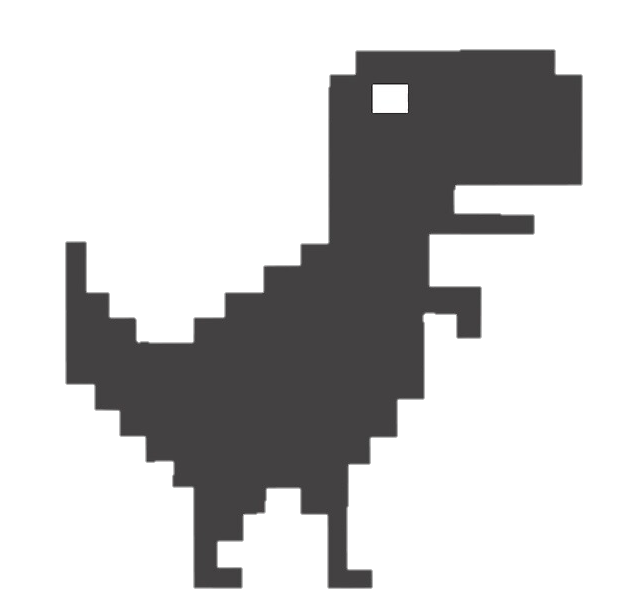

  

  _<h1>Hi! Me llamo Jose Zambrano</h1>_

**Me presento**; comencé a estudiar desarrollo web a finales de enero del 2021, desenvolviendome hasta el día de hoy traves del celular y la tablet, ya que no dispongo (por ahora) de una PC. Y eso no me detuvo, ni lo hará! 👻

Tampoco tengo Wi-Fi  por esa razon de vez en cuando suelo pausar la cuenta de [instagram](https://instagram.com/owljz18) que tengo 😅 dónde me gusta compartir tips de programacion, ya sea de _Javascript_ o de _CSS_.

En estos momentos tengo conocimiento de las siguientes tecnologias: 🤓

<pre>
&star; HTML 🌱
 
  &star; CSS 🎨
 
&star; JS 📏
 
  &star; Git 📊
 
&star; Markdown 📄
</pre>

Y me encuentro aprendiendo:

<pre>
&star; Nodejs con Express 📥
&star; SQL con Postgresql 🔐 
Junto a más cositas de BackEnd; Testing, Rest API's  etc.
</pre>

Acá les dejo mis estadisticas!
 

   
 
   

Y mis dos repos favoritos:

  
  

Por último, si desea ponerse en contacto, puede hacerlo vía <a href="mailto:owl.jz18@gmail.com">email</a>.

  <h3>Gracias por leer, que tengas un bonito día y que todo lo que te propongas te salga bien!</h3>

  

PD: @anuraghazra gracias!! => [github-readme-stats](https://github.com/anuraghazra/github-readme-stats)
